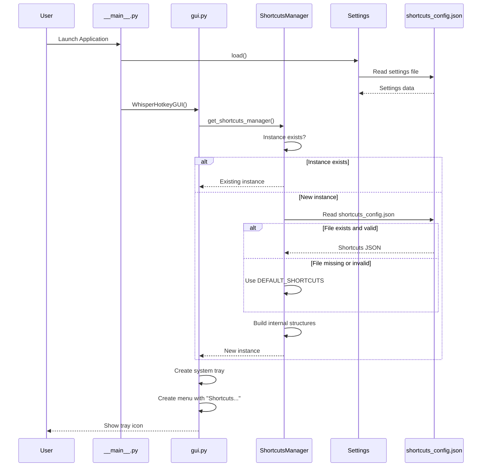
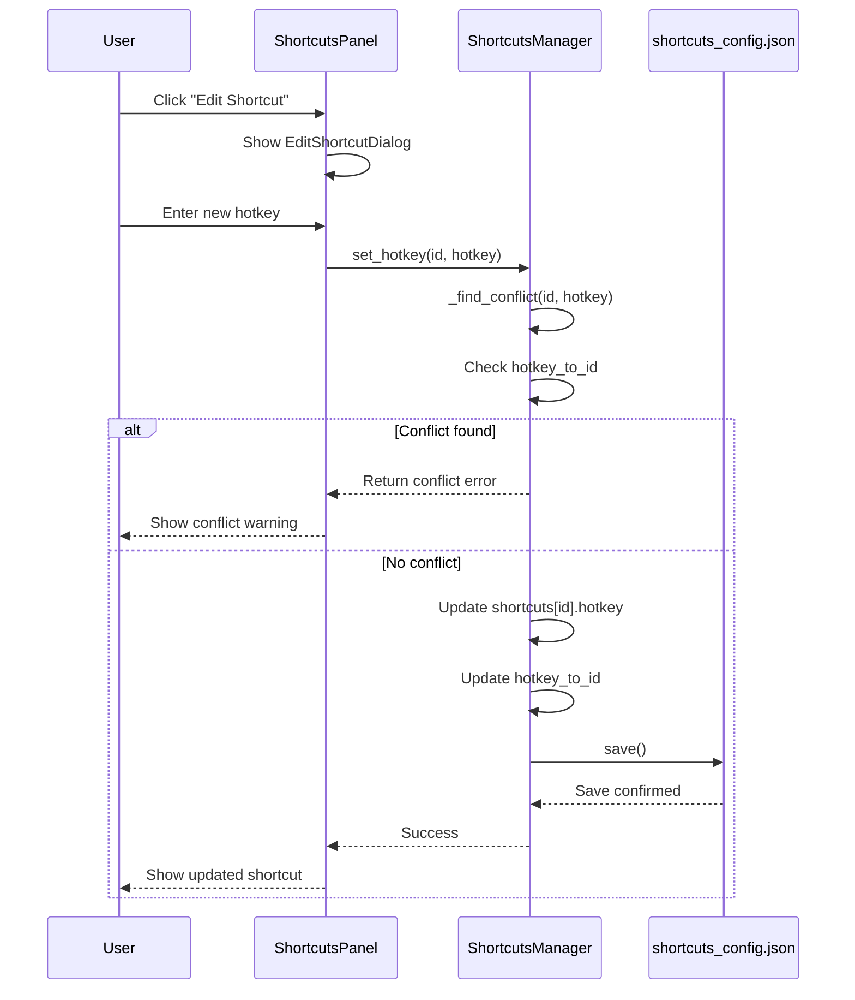
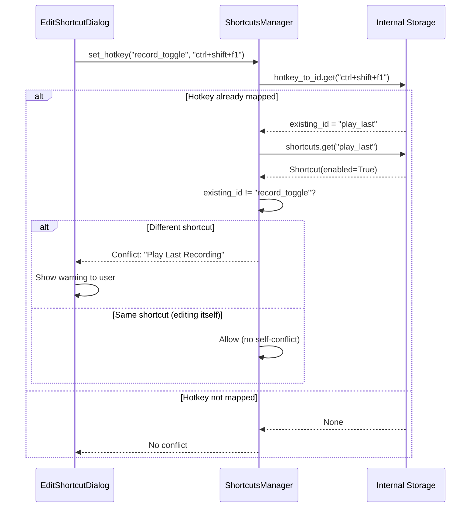
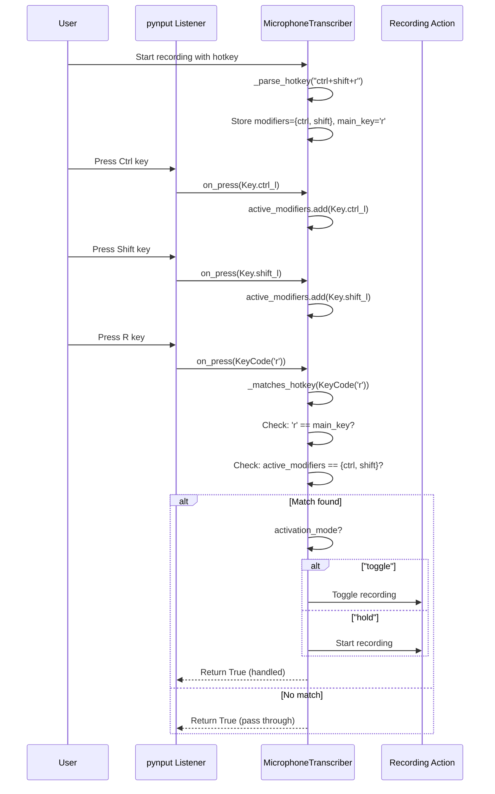
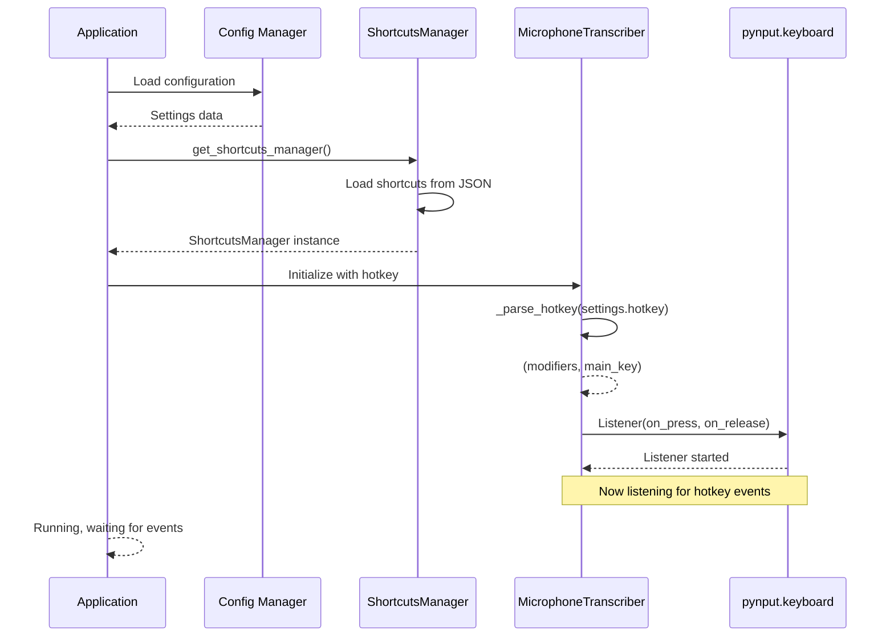

# Shortcuts System Architecture

This document provides a detailed technical explanation of how shortcuts are registered, validated, and bound throughout the application lifecycle.

## Table of Contents

1. [Overview](#overview)
2. [Core Components](#core-components)
3. [Data Structures](#data-structures)
4. [Registration Flow](#registration-flow)
5. [Validation Flow](#validation-flow)
6. [Binding Flow](#binding-flow)
7. [Initialization Sequence](#initialization-sequence)
8. [Sequence Diagrams](#sequence-diagrams)

---

## Overview

The shortcuts system is central to the faster-whisper-hotkey application, enabling users to control recording and playback via keyboard shortcuts. The system consists of:

- **ShortcutsManager**: Central registry for all shortcuts
- **HotkeyDialog**: Dialog for capturing the primary recording hotkey
- **ShortcutsPanel**: GUI for managing all shortcuts
- **MicrophoneTranscriber**: Binds hotkeys to actual keyboard events using pynput

---

## Core Components

### ShortcutsManager (`shortcuts_manager.py`)

The `ShortcutsManager` is a singleton class responsible for:

- Storing all shortcut definitions grouped by category
- Persisting shortcuts to `~/.config/faster_whisper_hotkey/shortcuts_config.json`
- Detecting conflicts between shortcuts
- Managing import/export of shortcut configurations
- Dispatching shortcut callbacks

**Key Methods:**

| Method | Purpose |
|--------|---------|
| `get_shortcuts_manager()` | Returns the singleton instance |
| `load()` | Loads shortcuts from JSON or defaults |
| `save()` | Persists current shortcuts to JSON |
| `set_hotkey(shortcut_id, hotkey)` | Updates a shortcut's hotkey with conflict detection |
| `register_callback(shortcut_id, callback)` | Registers a callback function for a shortcut |
| `_find_conflict(shortcut_id, hotkey)` | Returns conflicting shortcut if any |
| `detect_all_conflicts()` | Returns all current conflicts |

### Shortcut Dataclass

```python
@dataclass
class Shortcut:
    id: str                  # Unique identifier (e.g., "record_toggle")
    name: str                # Display name (e.g., "Toggle Recording")
    hotkey: str              # Key combination (e.g., "ctrl+shift+r")
    description: str         # What action this shortcut performs
    enabled: bool            # Whether the shortcut is active
```

### MicrophoneTranscriber (`transcriber.py`)

The `MicrophoneTranscriber` handles the actual keyboard event binding:

- Parses hotkey strings into pynput key objects
- Maintains active modifier key state
- Dispatches actions when hotkeys are pressed
- Supports two activation modes: "hold" and "toggle"

---

## Data Structures

### Default Shortcuts Definition

```python
DEFAULT_SHORTCUTS = {
    "recording": [
        {
            "id": "record_toggle",
            "name": "Toggle Recording",
            "hotkey": "pause",
            "description": "Start or stop recording",
            "enabled": True,
        }
    ],
    "playback": [
        {
            "id": "play_last",
            "name": "Play Last Recording",
            "hotkey": "f1",
            "description": "Play the most recent transcription",
            "enabled": True,
        },
        # ...
    ],
    "navigation": [...],
    "history": [...],
    "application": [...]
}
```

### Internal Storage (ShortcutsManager)

```python
self.shortcuts: Dict[str, Shortcut]        # All shortcuts by ID
self.groups: Dict[str, List[str]]          # Shortcut IDs grouped by category
self.hotkey_to_id: Dict[str, str]          # Hotkey to shortcut ID (case-insensitive)
self.callbacks: Dict[str, List[Callable]]  # Callback functions per shortcut
```

### Configuration File Format

**Location:** `~/.config/faster_whisper_hotkey/shortcuts_config.json`

```json
{
  "recording": [
    {
      "id": "record_toggle",
      "name": "Toggle Recording",
      "hotkey": "ctrl+shift+r",
      "description": "Start or stop recording",
      "enabled": true
    }
  ],
  "playback": [...],
  "navigation": [...],
  "history": [...],
  "application": [...]
}
```

---

## Registration Flow

Shortcut registration occurs during application initialization and when users modify shortcuts.

### 1. Initial Registration (Startup)

```
Application Start
       |
       v
ShortcutsManager.get_shortcuts_manager()
       |
       v
manager.load()
       |
       +---> Try: read from shortcuts_config.json
       |
       +---> Catch: use DEFAULT_SHORTCUTS
       |
       v
Populate self.shortcuts, self.groups, self.hotkey_to_id
```

### 2. Runtime Registration (User Edit)

```
User edits shortcut in ShortcutsPanel
       |
       v
manager.set_hotkey(shortcut_id, new_hotkey)
       |
       v
conflict = _find_conflict(shortcut_id, new_hotkey)
       |
       +---> If conflict found: Return error/conflict
       |
       +---> If no conflict:
              |
              v
         Update self.shortcuts[shortcut_id].hotkey
         Update self.hotkey_to_id[new_hotkey.lower()]
         Remove old hotkey from hotkey_to_id
         manager.save()
```

---

## Validation Flow

### Hotkey Format Validation

Hotkeys are validated by parsing the string format:

**Format:** `[modifier+]+key`

**Valid Modifiers:** `ctrl`, `alt`, `shift`, `win` (or `cmd` on macOS)

**Valid Keys:**
- Function keys: `f1` through `f12`
- Special keys: `pause`, `space`, `enter`, `tab`, `escape`
- Alphanumeric: Single characters (a-z, 0-9)

### Conflict Detection Algorithm

```python
def _find_conflict(self, shortcut_id: str, hotkey: str) -> Optional[Shortcut]:
    """
    Check if a hotkey conflicts with any existing enabled shortcut.

    Args:
        shortcut_id: The ID of the shortcut being validated
        hotkey: The hotkey string to check

    Returns:
        The conflicting Shortcut if found, None otherwise
    """
    hotkey_lower = hotkey.lower()
    existing_id = self.hotkey_to_id.get(hotkey_lower)

    if existing_id and existing_id != shortcut_id:
        existing = self.shortcuts.get(existing_id)
        if existing and existing.enabled:
            return existing

    return None
```

**Validation Rules:**

1. Case-insensitive comparison (Ctrl+R == ctrl+r)
2. Only enabled shortcuts can cause conflicts
3. A shortcut cannot conflict with itself (during editing)
4. All modifiers must match exactly

---

## Binding Flow

Binding connects hotkey strings to actual keyboard events using the `pynput` library.

### 1. Hotkey Parsing (MicrophoneTranscriber._parse_hotkey)

```python
def _parse_hotkey(self, hotkey_str: str) -> tuple[set[Key], Key]:
    """
    Parse a hotkey string into pynput key objects.

    Args:
        hotkey_str: String like "ctrl+shift+r" or "f1"

    Returns:
        Tuple of (modifier_keys, main_key)
    """
    key_mapping = {
        "pause": keyboard.Key.pause,
        "f1": keyboard.Key.f1,
        # ... more mappings
    }

    modifier_mapping = {
        "ctrl": {keyboard.Key.ctrl_l, keyboard.Key.ctrl_r},
        "alt": {keyboard.Key.alt_l, keyboard.Key.alt_r},
        "shift": {keyboard.Key.shift_l, keyboard.Key.shift_r},
        "win": {keyboard.Key.cmd_l, keyboard.Key.cmd_r},
    }

    parts = hotkey_str.lower().split("+")
    modifiers = set()
    main_key = None

    for part in parts:
        if part in modifier_mapping:
            modifiers.update(modifier_mapping[part])
        elif part in key_mapping:
            main_key = key_mapping[part]
        elif len(part) == 1:
            main_key = keyboard.KeyCode.from_char(part)

    return (modifiers, main_key)
```

### 2. Keyboard Event Handling

```
Keyboard Event
      |
      v
on_press(key) or on_release(key)
      |
      v
Is this a modifier key?
      |
      +---> Yes: Update active_modifiers set
      |                |
      |                v
      |           Return True (continue listening)
      |
      +---> No: Check if matches hotkey
                       |
                       v
                 _matches_hotkey(key)
                       |
                       v
              Is main_key == key AND
              active_modifiers == required_modifiers?
                       |
                       +---> Yes: Execute action
                       |            |
                       |            v
                       |      activation_mode == "toggle"?
                       |            |
                       |            +---> Yes: Toggle recording state
                       |            |
                       |            +---> No: Start recording (hold mode)
                       |
                       +---> No: Return True (continue listening)
```

### Activation Modes

| Mode | Press | Release |
|------|-------|---------|
| **toggle** | Toggles recording on/off | No effect |
| **hold** | Starts recording | Stops recording |

---

## Initialization Sequence

### GUI Mode Initialization

```
gui.py main()
      |
      v
Load settings from SETTINGS_FILE
      |
      v
Create WhisperHotkeyGUI
      |
      v
Initialize system tray icon
      |
      v
Check onboarding completion
      |
      v
ShortcutsManager.get_shortcuts_manager()
      |
      +---> Load shortcuts_config.json or defaults
      |
      v
Create tray menu with "Shortcuts..." option
      |
      v
Start GUI event loop
```

### CLI Mode Initialization (Record Command)

```
cli.py main() with "record" command
      |
      v
Parse command line arguments
      |
      v
Load settings (or use defaults)
      |
      v
Create MicrophoneTranscriber
      |
      v
Parse hotkey from settings
      |
      v
Start pynput keyboard listener
      |
      v
Wait for hotkey events
```

### ShortcutsManager Initialization

```
ShortcutsManager.__new__ (singleton)
      |
      v
Check if instance exists
      |
      +---> Yes: Return existing instance
      |
      +---> No: Create new instance
                 |
                 v
            Call load()
                 |
                 +---> Open shortcuts_config.json
                 |
                 +---> Parse JSON
                 |
                 +---> Validate structure
                 |
                 +---> Build shortcuts dict
                 |
                 +---> Build groups dict
                 |
                 +---> Build hotkey_to_id mapping
                 |
                 v
            Return instance
```

---

## Sequence Diagrams

### Application Startup Sequence



### Shortcut Registration Flow



### Conflict Detection Flow



### Keyboard Event Binding Flow



### Initialization Complete Flow



---

## Key Design Decisions

### 1. Singleton Pattern for ShortcutsManager

Ensures a single source of truth for shortcuts across the application. All components access the same instance via `get_shortcuts_manager()`.

### 2. Case-Insensitive Hotkey Mapping

Hotkeys are stored in lowercase in `hotkey_to_id` to prevent conflicts like `Ctrl+R` vs `ctrl+r`.

### 3. Separation of Concerns

- **ShortcutsManager**: Manages shortcut definitions and persistence
- **ShortcutsPanel**: Provides UI for editing shortcuts
- **MicrophoneTranscriber**: Handles actual keyboard event binding

### 4. Conflict Prevention at Multiple Levels

- During edit: `set_hotkey()` prevents conflicts
- During save: `detect_all_conflicts()` can validate entire config
- During import: Validation prevents importing conflicting shortcuts

---

## Extending the Shortcuts System

### Adding a New Shortcut

1. **Define in DEFAULT_SHORTCUTS:**
   ```python
   DEFAULT_SHORTCUTS = {
       "recording": [
           {
               "id": "my_new_shortcut",
               "name": "My New Shortcut",
               "hotkey": "ctrl+shift+n",
               "description": "Does something new",
               "enabled": True,
           }
       ]
   }
   ```

2. **Register callback in MicrophoneTranscriber:**
   ```python
   shortcuts_manager.register_callback("my_new_shortcut", self.my_action)
   ```

3. **Implement the action method:**
   ```python
   def my_action(self):
       # Your action here
       pass
   ```

### Adding a New Shortcut Group

1. **Update DEFAULT_SHORTCUTS** with the new group key
2. **Update ShortcutsPanel** to display the new group
3. **Update export/import** to handle the new group

---

## Troubleshooting

### Shortcuts Not Working

1. **Check if enabled:** Verify `shortcut.enabled == True`
2. **Check for conflicts:** Use `detect_all_conflicts()`
3. **Verify pynput listener:** Check if keyboard listener is running
4. **Check permissions:** Some platforms require accessibility permissions

### Conflicts Not Detected

1. **Verify case handling:** Ensure hotkeys are normalized to lowercase
2. **Check enabled status:** Only enabled shortcuts can conflict
3. **Validate hotkey_to_id:** Ensure mapping is updated on changes

### Persistence Issues

1. **Check file path:** `~/.config/faster_whisper_hotkey/shortcuts_config.json`
2. **Verify permissions:** Ensure write access to config directory
3. **Validate JSON:** Check for syntax errors in the config file
